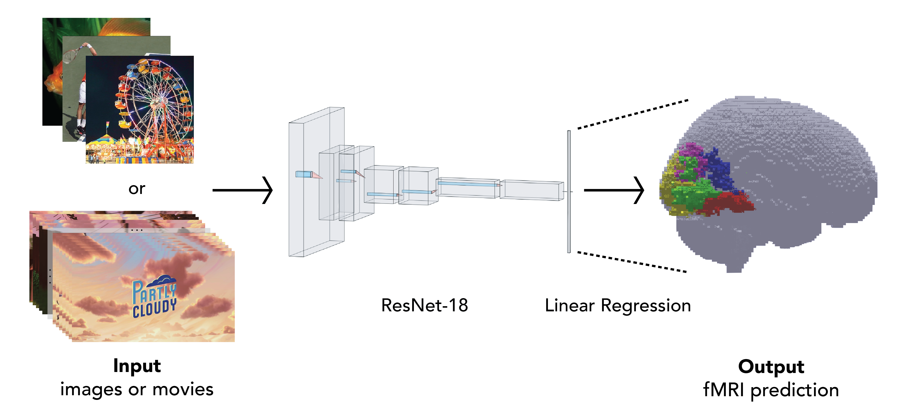

# img2fmri

**img2fmri**: a python package for predicting group-level fMRI responses to visual stimuli using deep neural networks

Users are encouraged to read the background science information for an overview of the model and its intended uses ([science_overview.pdf](science_overview.pdf)).

## Installation
To install and use img2fmri, users must work from a coding environment with [FSL](https://fsl.fmrib.ox.ac.uk/fsl/fslwiki/FslInstallation) and [AFNI](https://afni.nimh.nih.gov/pub/dist/doc/htmldoc/background_install/main_toc.html) installed, or use our Docker container which comes with those pre-installed. For users who already have FSL and AFNI installed, img2fmri can be installed with:

    pip install img2fmri

For users that intend to use our docker environment to test and use img2fmri, the Dockerfile included in this repo can be used to build an image as follows:

    docker build --no-cache --tag img2fmri --file Dockerfile .

and if successfully built, can be run with:

    docker run -it -p 8888:8888 img2fmri

Alternatively, our pre-built image can be pulled and used,though do note that this is a large (19GB) image.

    docker pull mbennett12/img2fmri
    docker run -it -p 8888:8888 img2fmri
    
And then from within this docker container:

    git clone https://github.com/dpmlab/img2fmri
    cd img2fmri

Optionally, users can install [Conda](https://docs.conda.io/en/latest/) and create an environment with python 3.9 ready for img2fmri e.g.: 

    conda create --name name_of_environment python=3.9
    conda activate name_of_environment
    pip install img2fmri

however, this conda environment still needs access to FSL and AFNI.

Users should now able to use the command-line interface for predicting fMRI responses as outlined in the section below.

### Jupyter notebook installation
In order to run the jupyter notebook analyses in [overview.ipynb](overview.ipynb) or [model_training.ipynb](model_training/model_training.ipynb), the following commands should be run.

If running the docker container from the command:

    docker run -it -p 8888:8888 img2fmri

users should then run the following command from within the container:

    python3 -m notebook --allow-root --no-browser --ip=0.0.0.0

in order to then access their docker container's jupyter notebook at the following url: `http://localhost:8888`. Note that users will need to copy and paste the token shown in the output of the previous command in their web browser to access their docker container's directory.

If not using the docker container, users should also install [jupyter-lab](https://jupyter.org/install) and then, if using conda, users should install ipykernel in order to add your conda environment to jupyter-lab to use with the analyses.

    python -m pip install jupyterlab
    conda install ipykernel
    ipython kernel install --user --name=name_of_environment

then refresh notebook to see and change the jupyter notebook's kernel to your new conda environment in top right corner.

## Usage
Users are encouraged to view the [overview.ipynb](overview.ipynb) notebook, which shows the import and use of the `img2fmri.predict()` function, as well as its extension to movies using `img2fmri.predict(predict_movie=True)`.

**img2fmri** can also be used as a command-line interface, as:

        python img2fmri.py [-h] --input input_dir [--output output_dir] [--roi_list each roi here]
                           [--sigma sigma_val] [--center_crop center_crop]

## Support or Questions
Users are encouraged to email [Max Bennett](mailto:mbb2176@columbia.edu) with questions or issues.

## License
This package is licensed under an MIT license in `LICENSE.txt`